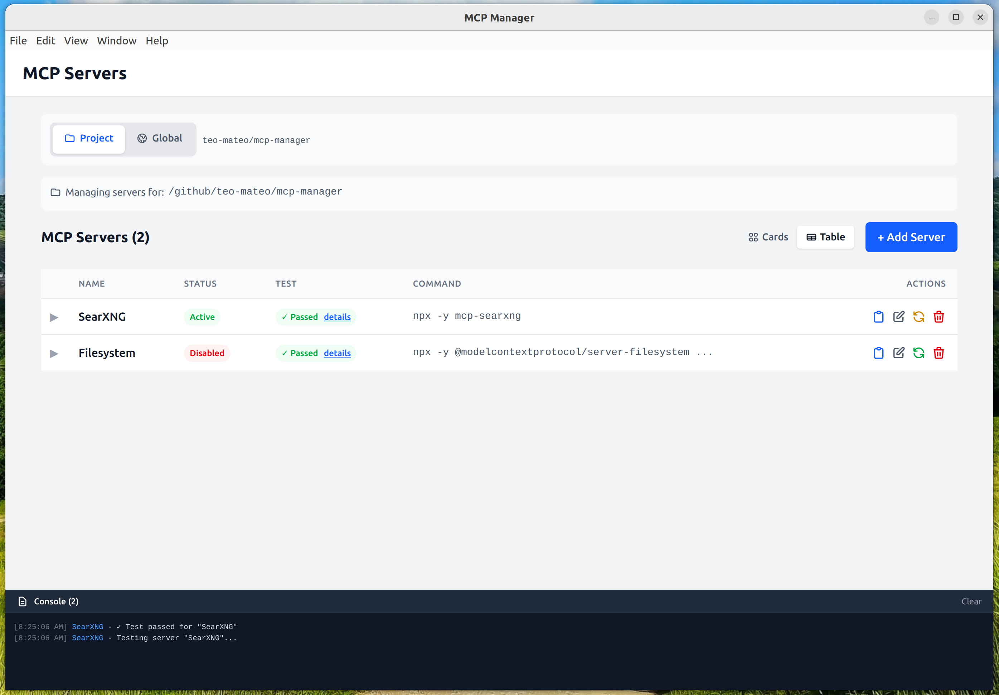

# MCP Manager

A desktop application for managing Model Context Protocol (MCP) servers in Claude Code. Features a modern GUI with modal-based editing, dual-mode JSON/Form editors, and support for both project-specific and global server configurations.


## 📸 Screenshot



*MCP Manager showing the table view with server list and console logging*

## ✨ Features

### Server Management
- 📋 **View & Organize** - Clean list view of all MCP servers with status indicators
- ✏️ **Dual Editor Modes** - Toggle between JSON and Form editors when adding/editing servers
- 🔄 **Enable/Disable** - Quick toggle to enable or disable servers
- 🗑️ **Delete** - Remove servers you no longer need
- 🧪 **Test Servers** - Test connectivity and view available capabilities

### Configuration Scopes
- 🎯 **Project Scope** - Manage servers specific to the current Claude Code project
- 🌍 **Global Scope** - Manage servers available across all projects
- 🔀 **Easy Switching** - Toggle between project and global scopes instantly

### User Interface
- 💬 **Modal-Based Editing** - Add and edit servers without leaving the main view
- 🎨 **Modern Design** - Clean, responsive interface with Tailwind CSS
- 📝 **Smart Validation** - Real-time validation with helpful error messages
- 💡 **Example Configs** - Built-in examples to get you started quickly

## 🚀 Quick Start

### Prerequisites

- **Node.js 18+** - [Download here](https://nodejs.org/)
- **npm** (comes with Node.js)
- **Claude Code** - The app manages servers for Claude Code projects

### Installation

#### Option 1: Global Installation (Recommended)

Install MCP Manager globally to use it from any directory:

```bash
# Clone the repository
git clone https://github.com/teo-mateo/mcp-manager.git
cd mcp-manager

# Install dependencies and build
npm install
npm run build

# Install globally
npm install -g .
```

Now you can run it from anywhere:

```bash
cd /path/to/your/claude/project
mcp-manager
```

#### Option 2: Development Mode

For development with hot-reload:

```bash
# Clone and install
git clone https://github.com/teo-mateo/mcp-manager.git
cd mcp-manager
npm install

# Terminal 1: Start build watchers
npm run dev

# Terminal 2: Run the app
NODE_ENV=development npx electron .
```

#### Option 3: Shell Alias

Add this to your `~/.bashrc` or `~/.zshrc`:

```bash
alias mcp-manager='node /path/to/mcp-manager/bin/mcp-manager.js'
```

Then reload: `source ~/.bashrc` (or `~/.zshrc`)

## 📖 Usage

### Basic Usage

Navigate to your Claude Code project and run:

```bash
mcp-manager
```

The app will:
1. ✅ Detect the current directory as your project path
2. ✅ Load project-specific MCP servers from `~/.claude.json`
3. ✅ Display an intuitive GUI for managing servers

### Specifying a Project Path

You can specify a different project path:

```bash
mcp-manager /path/to/another/project
```

### Managing Servers

**Add a Server:**
1. Click "Add Server" button
2. Choose JSON or Form mode
3. Enter server configuration
4. Click "Add Server" to save

**Edit a Server:**
1. Click "Edit" on any server card
2. Modify settings in JSON or Form mode
3. Click "Save Changes"

**Toggle Server:**
- Click the toggle button to enable/disable

**Delete Server:**
- Click "Delete" on the server card, or use the delete button in the edit modal

**Test Server:**
- Click "Test" to check connectivity and view capabilities

### Scope Management

Use the scope toggle at the top to switch between:
- **Project** - Servers specific to current project
- **Global** - Servers available to all Claude Code projects

## 🛠️ Development

### Setup

```bash
# Install dependencies
npm install

# Run in development mode (with hot reload)
npm run dev

# In another terminal, start Electron with the dev server
NODE_ENV=development npx electron .
```

### Build & Test

```bash
# Build for production
npm run build

# Run production build
npm start

# Run linter
npm run lint

# Format code
npm run format
```

### Project Structure

```
mcp-manager/
├── src/
│   ├── main/              # Electron main process
│   │   ├── main.ts        # Entry point, IPC handlers
│   │   ├── preload.ts     # Secure IPC bridge
│   │   └── services/      # Business logic
│   ├── renderer/          # React frontend
│   │   ├── App.tsx        # Main app component
│   │   ├── components/    # Reusable UI components
│   │   ├── screens/       # Screen components
│   │   ├── hooks/         # React hooks
│   │   └── services/      # Frontend API layer
│   └── shared/            # Shared types and utilities
│       ├── types.ts       # Core types
│       ├── mcpTypes.ts    # MCP protocol types
│       └── errors.ts      # Error definitions
├── dist/                  # Build output
├── bin/                   # Global executable script
└── package.json
```

## 🔧 How It Works

### Architecture

MCP Manager uses a **client-server architecture** within Electron:

1. **Main Process** - Handles file I/O, configuration management, and MCP server testing
2. **Renderer Process** - React-based UI running in a sandboxed environment
3. **IPC Bridge** - Secure communication via `preload.ts` with context isolation

### Configuration Management

The app integrates seamlessly with Claude Code's configuration structure:

**File Location:** `~/.claude.json`

**Structure:**
```json
{
  "projects": {
    "/absolute/path/to/project": {
      "mcpServers": { /* active servers */ },
      "mcpServers_disabled": { /* disabled servers */ }
    }
  },
  "mcpServers": { /* global active servers */ },
  "mcpServers_disabled": { /* global disabled servers */ }
}
```

**Key Features:**
- ✅ **Project Detection** - Uses current working directory as project path
- ✅ **Dual Scope** - Manages both project-specific and global servers
- ✅ **Atomic Writes** - Safe file operations with backup creation
- ✅ **Conflict Detection** - Timestamp-based change detection
- ✅ **Preservation** - Keeps all other settings intact when updating

## ❓ Troubleshooting

### "Project not found" Error

**Problem:** Your current directory isn't registered in Claude Code.

**Solution:**
1. Open the project in Claude Code first
2. This initializes the project in `~/.claude.json`
3. Run `mcp-manager` again

**Alternative:** Switch to **Global** scope to manage global servers

### Application Won't Start

**Check your installation:**
```bash
# Verify build succeeded
npm run build

# Check global installation
npm list -g mcp-manager

# Try reinstalling
npm install -g .
```

### Permission Errors During Install

**Recommended Solutions:**

1. **Use Node Version Manager (Best):**
   ```bash
   # Install nvm
   curl -o- https://raw.githubusercontent.com/nvm-sh/nvm/v0.39.0/install.sh | bash

   # Install Node via nvm
   nvm install 18
   nvm use 18
   ```

2. **Configure npm prefix:**
   ```bash
   npm config set prefix ~/.npm-global
   export PATH=~/.npm-global/bin:$PATH
   ```

3. **Use sudo (Not Recommended):**
   ```bash
   sudo npm install -g .
   ```

### Dev Server Connection Errors

If running in development mode and seeing connection errors:

- Make sure `npm run dev` is running in one terminal
- Use `NODE_ENV=development npx electron .` in another terminal
- Check that port 5173 is not in use by another process

### Build Failures

**Common causes:**
- Node.js version too old (need 18+)
- Missing dependencies: run `npm install`
- TypeScript errors: run `npm run lint` to check

## 📦 Uninstalling

To remove the globally installed package:

```bash
npm uninstall -g mcp-manager
```

## 🤝 Contributing

Contributions are welcome! Please feel free to submit a Pull Request.

## 📄 License

ISC

## 🔗 Links

- [Model Context Protocol Documentation](https://modelcontextprotocol.io/)
- [Claude Code](https://claude.com/claude-code)
- [Report Issues](https://github.com/teo-mateo/mcp-manager/issues)